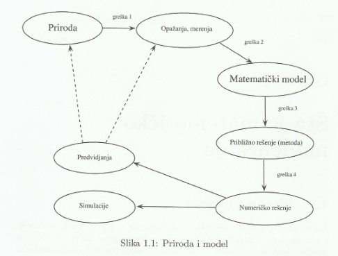

# Osnove matematičkog modeliranja

## 1. Odnos stvarnosti i modela i razlozi za modeliranje.

* Većina prirodnih pojava nisu slučajne, već postoje zavisnosti i uslovljenosti koje možemo predstaviti modeliranjem
* Odstupanja modela od stvarnosti - nepreciznost čula i mernih instrumenata, kao i namerna pojednostavljivanja pojava
* Matematički model - opisivanje neke pojave ili koncepta korišćenjem matematičkih koncepata i jezika

    

* Razlozi za modeliranje:

    1.  Eksperimente je nemoguće izvesti - efekat staklene bašte
    2.  Eksperimente nije poželjno izvesti - fisija i fuzija
    3.  Eksperimenti su veoma skupi - uticaj radijacije na genetski materijal
    4.  Kontrola procesa - optimizacija ulova ribe
    5.  Modeliranje za konstrukciju mernih uređaja - živin termometar
    6.  Bolje razumevanje pojava na osnovu modeliranja - sunčev sistem
    7.  Korišćenje modela u obrazovanju - u svrhu obuke kompleksan sistem menjamo modelom

## 2. Koraci i smernice u procesu matematičkog modeliranja.

* Koraci

    1.  Prepoznavanje problema - odrediti šta modeliramo, u kom cilju, kao i kolika su dozvoljena odstupanja od stvarnosti, zatim sakupiti već postojeće eksperimentalne podatke i planirati prikupljanje budućih
    2.  Formulacija matematičkog modela - izabrati odgovarajuće parametre, uočiti njihove međusobne zavisnosti i na osnovu tih zavisnosti, zakonitosti odgovarajuće nauke i prirode samog problema odrediti matematički model
    3.  Testiranje kvaliteta modela - na osnovu prethodno izvedenih eksperimenata odrediti opsege parametra formiranog modela u kojima je odstupanje od stvarnosti manje od prethodno određenog maksimalnog odstupanja
    4.  Prezentacija modela i rezultata - prikazati rezultate onima kojima su rezultati od koristi

* Smernice

    1.  Pri prepoznavanju modela moraju biti jasni namena i cilj modeliranja
    2.  Pri formulaciji modela gledamo da model bude samo onoliko komplikovan koliko mora
    3.  Promenljive i parametri modela treba da imaju svoju interpretaciju u stvarnosti
    4.  Ukoliko utvrdimo da model ne ispunjava postavljene ciljeve, moramo ga odbaciti u korist novog modela

## 3. Vrste matematičkih modela i uloga matematičara u procesu modeliranja.

* Vrste modela

    1.  Kontinualni ili diskretni
    2.  Deterministički ili stohistički
    3.  Linearan ili nelinearan
    4.  Statički ili dinamički
    5.  Deduktivni ili induktivni

* Uloga matematičara

    Matematičari su bitni u modeliranju zbog poznavanja matematičkih teorija i metodologija, ali moraju znati osnovnu terminologiju iz oblasti koju modeliraju radi uspešne komunikacije. Važni zadaci matematičara su ispitivanje modela sa apstraktne, matematičke strane, kao i određivanja stabilnosti metode rešavanja problema i određivanje numeričkih metoda koje će dovesti do najveće tačnosti ukoliko je numeričko rešavanje neophodno.
    
## 4. Kos hitac.
* Problem je odrediti trajektoriju i domet projektila

    

* Pretpostavke:
    1. Projektil je tačka sa pozitivnom masom 
    2. Tačka ispaljivanja projektila je na tlu
    3. U svakom trenutku možemo tačno izmeriti vreme, visinu i daljinu (trajektoriju projektovanu na osu)
    4. Sve se dešava u vakuumu
    5. Zemlja je ravna, gravitacija deluje na dole
    6. Jačina zemljine teže ne zavisi od visine
    7. Visina $x(t)$ i daljina $y(t)$ su dvaput neprekidno diferencijabilne

* Iz pretpostavki i rasčlanjivanja $v_0$ na $v_{0x}$ i $v_{0y}$ zaključujemo da je $y''(t) = -g$ pa važi da je $y'(t) = v_{0y} - gt$ i da je $y(t) = v_{0y}t - {gt^2 \over 2}$
* Kako je početna brzina $v_0$ pod uglom $\theta$ imamo da je $v_{0y} = y(0) = v_0 \sin \theta$ i $v_{0x} = x(0) = v_0 \cos \theta$, pa kako je horizontalna brzina konstanta zaključujemo da je $x(t) = (v_0 \cos \theta)t$ i $y(t) = (v_0 \sin \theta)t - {gt^2 \over 2}$
* Maksimum za $y(t)$ se dostiže u tački u kojoj je $y'(t) = (v_0 \sin \theta) - gt = 0$ odnosno $t_1 = {(v_0 \sin \theta) \over g}$. U ovom trenutku $t_1$ važi $x(t_1) = {v_0^2\sin 2\theta \over 2g}$ i $y(t1) = {v_0^2\sin^2\theta \over 2g}$
* Maksimum za $x(t)$ se dostiže u tački u kojoj projektil pada na tlo, odnosno $y(t_2) = 0$, pa je $t_2 = {2v_0\sin\theta \over g} = 2t_1$. U ovom trenutku važi $x(t_2) = {v_0^2\sin 2\theta \over g} = 2x(t_1)$
* Napravimo pretpostavku stabilnosti - ukoliko prethodne pretpostavke nisu mnogo pogrešne ni rezultati modela se neće mnogo razlikovati.
* Zaključujemo da se maksimalna visina postiže za $\theta = {\pi \over 2}$ dok maksimalni domet dostižemo za $\theta = {\pi \over 4}$

## 5. Matematičko klatno.

* Matematičko klatno se sastoji iz tačkastog tela mase $m$ koje je krutim štapom dužine $l$ vezano za neku fiksiranu tačku. Kladno je u početnom trenutku otklonjeno od ravnotežnog položaja za ugao $\theta_0$, a zatim se pušta bez uticaja ikakve spoljašne sile.

    

* Na teg deluje sila teže $F = mg, g \approx 9.81{m\over s^2}$, a cilj nam je odrediti otklon klatna u proizvoljnom trenutku t.

* Sila gravitacije koja deluje na teg se može razložiti na radijalnu i tangencijalnu komponentu. Pošto je klatno nerastegljivo radijalna komponenta ne utiče na kretanje, dok za tangencijalnu $F_t$ važi $$\sin \theta = {-F_t \over F} \implies F_t = -mg\sin \theta = m \cdot {d^2s \over dt^2}$$ gde je $s(t) = l\cdot \theta(t)$ dužina luka koji predstavlja rastojanje od ravnotežnog položaja. Dalje važi $${d^2s\over dt^2} = -g\sin \theta \implies {d^2\theta \over dt^2} = {-g \over l}\sin \theta$$

* Datu diferencnu jednačinu nije moguće rešiti analitički, ali ima jedinstveno numeričko rešenje $$\theta(t) = \theta_0\cos(\sqrt{g\over l}t)$$
* Bitno je naglasiti da je ovo rešenje pri zanemarivanju otpora vazduha. Ukoliko ga ne zanemarimo moramo uračunati i silu otpora proporcijalnu brzini $F_0 = -B \cdot {ds \over dt}$ pa dobijamo model klatna sa prigušenjem: $${d^2\theta\over dt^2} = {-B \over m} \cdot {ds \over dt} - {g\over l}\sin\theta$$

## 6. Matematičko klatno (preko zakona održanja energije).

* Iz zakona održanja energije sledi da je zbir potencijalne i kinetičke energije tela konstantan, tj. da su promene potencijalne i kinetičke energije od početnog trenutka t jednake $${mv^2 \over 2} = mgh$$ odnosno ukoliko izvučemo brzinu $$v = \sqrt{2gh}$$
    
    

* Brzina je izvod pređenog puta $v = {ds\over dt} = l {d\theta \over dt}$ pa dobijamo $${d\theta \over dt} = {\sqrt{2gh} \over l}$$ Kako je $h = y_1 - y_0 = l\cos \theta - l cos\theta_0$ dobijamo $${d\theta \over dt} = \sqrt{{2g\over l}(cos\theta - cos\theta_0)}$$ što diferenciranjem po vremenu daje $${d^2\theta\over dt^2} = {d\over d\theta}({d\theta \over dt}) \cdot {d\theta \over dt} = ... = {-g \over l}\sin \theta$$

* Ponovo numeričkim rešavanjem dobijamo $$\theta(t) = \theta_0\cos(\sqrt{g \over l} \cdot t)$$

## 7. Rast populacije.

* Problem je utvrditi zakon promene broja jedinki neke žive populacije tokom vremena

* Natalitet $n$ i mortalitet $m$ je proporcionalan veličini populacije $N(t)$ i proteklom vremenu $\Delta t$ pa je $$N(t+\Delta t) = N(t) + n\Delta tN(t) - m\Delta tN(t)$$ odnosno $${N(t+\Delta t) - N(t) \over \Delta t} = pN(t)$$ gde je $p = n-m$ priraštaj populacije. Ovo je dobar model ako nemamo spoljno promenljivih resursa.

* Ako $N(t)$ posmatramo kao kontinualnu veličinu i pretpostavimo da $\Delta t$ može uzimati proizvoljno male vrendosti prethodnu jednačinu svodimo na diferencijalnu $${dN(t) \over dt} = pN(t)$$ koja ima rešenje $$N(t) = N(0) e^{pt}$$ odakle zaključujemo da će se populacija menjati eksponencijalno u odnosu na proteklo vreme.

* U realnim situacijama, priraštaj se menja sa brojem jedinki, zato što ograničeni resursi ograničavaju eksponencijalni rast populacije, pa uvodimo parametar $K$ koji predstavlja maksimalni broj jedinki održiv u staništu. Model je sada: $${dN(t) \over dt} = rN(t)(1 - {N(t) \over K})$$ koji nazivamo logistički model i on ima rešenje: $$N(t) = {{N(0) e^{rt}} \over 1 + {{N(0) \over K} (e^{rt}-1)}}$$

* Smenom $x(t) = {N(t) \over K}$ dobijamo: $${dx \over dt} = rx(1-x)$$ Ovo nazivamo logističkom jednačinom i ona ima rešenje: $$x(t) = {{x(0) e^{rt}} \over 1 + {x(0)(e^{rt}-1)}}$$

## 8. Grabljivci i plen.

* Neka je $G(t)$ broj grabljivaca, a $P(t)$ broj plena u trenutku $t$ u posmatranom staništu. Postavljamo pretpostavke da se grabljivci hrane isključivo jedinkama plena, dok plen ima dovoljno hrane da ne utiče na njihovu smrtnost. Model tada možemo predstaviti sistemom diferencijalnih jednačina : $${dP \over dt} = aP - bPG$$ $${dG \over dt} = cPG - mG$$ gde je $aP$ stopa promene populacije plena kad ne bi bilo grabljivaca, $bPG$ stopa umanjenja populacije plena usled napada grabljivaca, jednaka broju susreta na staništu koji je direktno proporcionalan proizvodu broja jedinki, $cPG$ stopa rađanja grabljivaca direktno zavisna od broja ulovljenog plena, a $mG$ stopa smrtnosti grabljivaca u odsustvu plena.

* Stacionarna rešenja modela (ona u kojima nema dalje promene u populacijama) dobijaju se rešavanjem sistema, tako što uvedemo $P_s = {m \over c}$ i $G_s = {a \over b}$ pa dobijamo: $${dP \over dt} = aP(1- {G \over G_s})$$ $${dG \over dt} = -mG(1- {P \over P_s})$$ Daljom smenom $x(t) = {P(t) \over P_s}$ i $y(t) = {G(t) \over G_s}$ dobijamo rešenje: $$a(\ln y - y) + m(\ln x - x) = C$$ Za različite konstante $C$ dobijamo različite trajektorije modela na kom se vidi da populacije večno osciluju. Ovakav model naziva se Lotka-Volter model.

    

## 9. Dimenzije i jedinice fizičkih veličina.

* Dimenziona analiza je metoda kojom se izvode zaključci o nekoj pojavi samo na osnovu pretpostavke da se ta pojava može opisati dimenziono korektnom jednačinom koja povezuje neke promenljive.

* Svaka fizička veličina $Q$ ima svoju fizičku dimenziju u oznaci $\delta(Q)$. Za fizičke veličine $Q_1, ... , Q_n$ i $a_1, ... , a_n \in \mathbb{Q}$ važi $\delta(Q_1^{a_1}...Q_n^{a_n}) = \delta(Q_1)^{a_1}\cdot...\cdot\delta(Q_n)^{a_n}$

* Različite naučne oblasti koriste različite veličine sa različitim dimenzijama, pa je neophodno da uvedemo pojam osnovnih dimenzija naučne oblasti. Dimenzije $\delta_1, ... , \delta_k$ nazivamo osnovnim dimenzijama neke naučne oblasti ukoliko se dimenzija svake veličine $Q$ može na jedinstven način predstaviti u obliku $\delta(Q) = \delta_1^{a_1} \cdot ... \cdot \delta_k^{a_k}$. Jedan primer skupa osnovnih dimenzija koji se koristi u mehanici je masa $m$, dužina $L$ i vreme $T$. Kao primer, dimenzija za brzinu bi bila $\delta(v) = LT^{-1}$.

* Merenje fizičkih veličina se izvodi poređenjem sa nekom drugom fizičkom veličinom iste dimenzije koja je po dogovoru uzeta za etalon tj. osnovnu jedinicu. Osnovne jedinice $[\delta_i], i = \overline {1,k}$ su jedinice osnovnih fizičkih veličina, a ostale se izvode preko osnovnih i nazivaju izvedene jedinice. Za jednu oblast moguće uvesti više sistema osnovnih jedinica, ali najrasprostranjeniji je međunarodni SI sistem jedinica koji je uveden radi standardizacije.

* Fizička veličina $Q$ se može predstaviti kao $Q = v(Q)[Q]$ gde je $v(Q)$ numerička vrednost, a $[Q]$ jedinica.

## 10. Dimenziona homogenost.

* Pravila za operacije nad fizičkim veličinama potrebna da bi se očuvala dimenziona korektnost:
    1. Ako je $Q_1 = Q_2$, tada je $\delta(Q_1) = \delta(Q_2)$
    2. $\delta(Q_1^{a_1} \cdot Q_2^{a_2}) = \delta(Q_1)^{a_1} \cdot \delta(Q_2)^{a_2}, a_1, a_2 \in \mathbb{Q}$
    3. $Q_1 \pm Q_2$ je fizička veličina akko je $\delta(Q_1) = \delta(Q_2)$ i tada važi $\delta(Q_1 \pm Q_2) = \delta(Q_1) = \delta(Q_2)$
    4. Brojevi su bezdimenzioni, tj. $\delta(\xi) = \delta(Q^0) = \delta(Q)^0 = 1, \forall Q$
    5. Veličine argumenata nepolinomijalnih funkcija moraju biti bezdimenzione, npr. da bi $e^{\omega t}$  imalo smisla za $\delta(t) = T$, mora važiti $\delta(\omega) = T^{-1}$

* Neka je $Q = Q_1^{a_1} \cdot ... \cdot Q_n^{a_n}, a_1,..., a_n \in \mathbb{Q}$, tada je:

    1. $\delta(Q) = \delta(Q_1)^{a_1} \cdot ... \cdot \delta(Q_n)^{a_n}$
    2. $[Q] = [Q_1]^{a_1} \cdot ... \cdot [Q_n]^{a_n}$
    3. $v(Q) = v(Q_1)^{a_1} \cdot ... \cdot v(Q_n)^{a_n}$

* Za veličine $Q_1,...,Q_n$ kažemo da su dimenziono nezavisne ako važi: $Q = Q_1^{a_1} \cdot ... \cdot Q_n^{a_n}, a_1,..., a_n \in \mathbb{Q} \iff (\delta(Q) = 1 \implies a_1 = ... = a_n = 0)$

* Moguća je promena sistema osnovnih jedinica sa $[\delta_1],...,[\delta_n]$ na $[\delta_1]_*,...,[\delta_n]_*$ gde je $[\delta_i] = x_i[\delta_i]_*, i = \overline{1,k}$, gde su $x_1,...,x_n \in \mathbb{R}$ fiksirani pozitivni brojevi koje nazivamo faktorima konverzije osnovnih jedinica. U tom slučaju za veličinu $Q = v(Q)[Q] = v_*(Q)[Q]_*$ važi:
    1. $v_*(Q) = x_1^{a_1} \cdot ... \cdot x_k^{a_k}v(Q)$
    2. $[Q] = [\delta_1]^{a_1} \cdot ... \cdot [\delta_k]^{a_k}$
    3. $[Q]_* = [\delta_1]_*^{a_1} \cdot ... \cdot [\delta_k]_*^{a_k}$

* Matrica $M=m_{ij}$ čiji svaki red odgovara nekoj osnovnoj dimenziji $\delta_1,...,\delta_k$, a svaka kolona nekoj veličini $Q_1,...,Q_n$ i gde je svaki element $m_{ij}$ jednak stepenu dimenzije $\delta_i$ u veličini $Q_j$ naziva se dimenziona matrica.

* Neka je $Q = Q_1^{a_1} \cdot ... \cdot Q_n^{a_n}$. Za ovakvu veličinu važi da je bezdimenziona akko je $Ma = 0$, gde je $a = (a_1,...,a_n)$

* Neka je $F$ funkcija $n$ promenljivih, pa možemo reći da $f(Q_1,...,Q_n)=0$ ima fizičkog smisla ako važi sledeće:
    1. $f(Q_1,...,Q_n)$ je takođe fizička veličina, tj. važe pravila $$v(f(Q_1,...,Q_n)) = f(v(Q_1),...,v(Q_n))$$ $$\delta(f(Q_1,...,Q_n)) = \delta_1^{\beta_1} \cdot ... \cdot \delta_k^{\beta_k}, \beta_1,...,\beta_k \in \mathbb{Q}$$ $$[f(Q_1,...,Q_n)] = [\delta_1]^\beta_1 \cdot...\cdot [\delta_k]^\beta_k$$
    2. Za proizvoljne realne $\rho_1,...,\rho_n$ i pozitivne realne $x_1,...,x_n$ važi $$f(x_1^{m_{11}}\cdot...\cdot x_k^{m_{k1}}\rho_1,...,x_1^{m_{1n}}\cdot...\cdot x_k^{m_{kn}}\rho_n) = x_1^{\beta_1}\cdot ... \cdot x_k^{\beta_k}f(\rho_1,...,\rho_n)$$ 
    3. Pošto je veličina $f(Q_1,...,Q_n)$ izražena preko veličina onda i jedinica za tu veličinu mora biti povezana sa jedinicama veličine $Q_i$ formulom $[f(Q_1,...,Q_n)] = [Q_1]^{k_1}\cdot ... \cdot [Q_n]^{k_n}$ za neke $k_1,...,k_n \in \mathbb{Q}$

* Za funkciju koja ispunjava ove uslove kažemo da je homogena funkcija.

## 11. Svođenje na bezdimenzione veličine - primer slobodnog pada.

* Svođenjem veličina koje se koriste u modelu na bezdimenzione često možemo doneti važne zaključke o posmatranoj pojavi bez rešavanja samog modela. Ovim takođe često možemo i smanjiti broj parametara u modelu. Bitno je pomenuti i da je jednačina $F(Q_1,...,Q_n) = 0$ fizički smislena za proizvoljnu funkciju $F$ ukoliko su veličine $Q_1,...,Q_n$ bezdimenzione.

* Posmatrajmo slobodan pad tela u vakuumu pod dejstvom gravitacije. Potencijalno značajne veličine za ovaj problem su masa tela $m$, visina $h$, brzina $v$ i gravitaciono ubrzanje $g$. Sledi da bi jednačina u modelu trebalo biti oblika $F(m,h,v,g)=0$ međutim pogledajmo dimenzije svake veličine: $\delta(m) = M$, $\delta(h) = L$, $\delta(v) = LT^{-1}$, $\delta(g) = LT^{-2}$. Dimenzija mase $M$ se pojavljuje samo na jednom mestu pa sledi da je masu tela $m$ nemoguće kombinovati sa ostalim veličinama da bi dobili bezdimenzionu veličinu. Zaključujemo da je masa $m$ višak u ovom modelu i da ona ne utiče na kretanje tela pri slobodnom padu. Jednačina u modelu je tada oblika $F_1(h,v,g)=0$

* Što se tiče samog svođenja ovih parametara na bezdimenzione možemo da:
    1. Eliminišemo dimenziju vremena iz modela $$\delta({v^2 \over g}) = {L^2 \over T^2} \cdot {T^2 \over L} = L$$
    2. Eliminišemo dimenziju dužine iz modela $$\delta({v^2 \over gh}) = {L \over L} = 1 \implies F_1({v^2 \over gh}) = 0 \implies {v^2 \over gh} = const. \implies v = const. \cdot \sqrt{gh}$$
    3. Da bismo tačno odredili dobijenu konstantu moramo izaći iz okvira dimenzione analize.

## 12. Svođenje na bezdimenzione veličine - rotacija sistema dva tela.

* Posmatramo rotaciju sistema dva tela uzrokovanu međusobnim gravitacionim privlačenjem. Pretpostavimo da su značajne veličine za ovaj model period rotacije $T_r$ mase oba tela $m_1$ i $m_2$ i rastojanje između njih r. Ovo nam daje jednačinu $F(T_r, m_1, m_2, r) = 0$, pritom dimenzije ovih veličina su: $\delta(T_r) = T$, $\delta(m_1) = \delta(m_2) = M$, $\delta(r) = L$. Dimenzije T i L se pojavljuju samo po jednom, ali njihovo izbacivanje nema smisla, pa zaključujemo da nam fali neka veličina koja povezuje sve ostale, a to je Njutnova gravitaciona sila $G$, $\delta(G) = {L^3 \over MT^2}$, pa imamo da je jednačina modela oblika $F_1(T_r,m_1,m_2,r,G) = 0$.

1. Eliminšemo dimenziju vremena sa $F_2(m_1, m_2, r) = T_r\sqrt{G}$ $$\delta(T_r\sqrt{G}) = T\cdot {\sqrt{L^3}\over\sqrt{M}T} = \sqrt{L^3 \over M}$$
2. Eliminišemo dimenziju dužine sa $F_3(m_1,m_2) = {T_r\sqrt{G}\over\sqrt{r^3}}$ $$\delta({T_r\sqrt{G}\over\sqrt{r^3}}) = {\sqrt{L^3}\over\sqrt{ML^3}} = {1\over\sqrt{M}}$$
3. Eliminišemo dimenziju mase sa $F_4(m_1,m_2) = {T_r\sqrt{Gm_2}\over\sqrt{r^3}}$ $$\delta({T_r\sqrt{Gm_2}\over\sqrt{r^3}}) = {\sqrt{M} \over \sqrt{M}} = 1 \implies $$
4. Jedini način da $F_4(m_1,m_2)$ bude bezdimenziona je ukoliko se radi o količniku dve mase pa je $${T_r\sqrt{Gm_2}\over\sqrt{r^3}} = F_5({m_1 \over m_2}) \implies T_r = \sqrt{r^3 \over Gm_2}F_5({m_1 \over m_2})$$
5. Iz ovoga možemo dobiti treći Keplerov zakon za $m_1 \ll m_2$.

## 13. Bakingemova Pi teorema i primer matematičkog klatna.

* Neka su $Q_1,...,Q_n$ fizičke veličine, $M$ dimenziona matrica ovih veličina u odnosu na osnovne dimenzije $\delta_1,...,\delta_k$ i $p$ je rang matrice $M$. Tada je svaka fizički smislena jednačina $F(Q_1,...,Q_n)=0$ ekvivalentna jednačini $F(\Pi_1,...,\Pi_{n-p}) =0$ za funkciju $F$ gde su $\Pi_i, i = \overline{1,n-p}$ bezdimenzione veličine za koje važi $\Pi_i = Q_1^{\alpha_{1i}} \cdot ... \cdot Q_n^{\alpha_{ni}}$ za neke brojeve $\alpha_{ji} \in \mathbb{Q}$. Vektori $a_i=(\alpha_{1i},...,\alpha_{ni})^T$ čine bazu prostora rešenja jednačine $Ma=0$

* Na osnovu teoreme znamo da je uvek moguće transformisati fizički smislenu jednačinu na bezdimenzione veličine

* Posmatrajmo matematičko klatno. Period oscilovanja klatna T zavisi od mase tega $m$, dužine klatna $l$, gravitacionog ubrzanja $g$ i početnog ugla $\theta_0$. Sledi da bi jedna;ina modela trebalo da bude oblika $f(T,m,l,g,\theta_0) = 0$ Dimenzije parametara su $\delta(T) = T$, $\delta(m) = M$, $\delta(l) = L$, $\delta(g) = LT^{-1}$, $\delta(\theta_0) = 1$ 

* Tada imamo dimenzionu matricu $$M = \begin{pmatrix}
1 & 0 & 0 & -2 & 0\\
0 & 1 & 0 & 0 & 0\\
0 & 0 & 1 & 1 & 0
\end{pmatrix}$$
čiji rang je 3, pa prostor rešenja sistema $Ma = 0$ ima dimenziju 5-3=2. Linearno nezavisna rešenja su $a_1 = (2,0,-1,1,0)$ i $a_2 = (0,0,0,0,1)$ što daje $\Pi_1 = T^2g/l$ i $\Pi_2 = \theta_0$ pa je polazna jednačina ekvivalentna sa $F(T^2g/l,\theta_0) = 0$ ili $T = \sqrt{l\over g}\Phi(\theta_0)$

## 14. Bakingemova Pi teorema i primer probe nuklearne bombe.

* Tejlor je samo na osnovu snimka probe nuklearne bombe uspeo da zaključi koliko je energije oslobođeno. Poluprečnik vatrene lopte $R$ zavisi od vremena $t$, gustine vazduha $\rho$, i oslobođene energije $E$, pa je jednačina modela oblika $f(R,t,\rho,E) = 0$ sa dimenzijama $\delta(R) = L, \delta(t) = T, \delta(\rho) = {M \over L^3}, \delta(E) = {ML^2 \over T^2}$. Dimenziona matrica je $$M =\begin{pmatrix}
0 & 1 & 0 & -2\\
0 & 0 & 1 & 1\\
1 & 0 & -3 & 2
\end{pmatrix}$$
čiji rang je 3, pa prostor rešenja jednačine $Ma = 0$ ima dimenziju 1. Vektor rešenja $a_1 = (-5,2,-1,1)$ daje $\Pi_1 = {Et^2\over R^5\rho}$ odnosno $$F({Et^2\over R^5\rho}) = 0 \implies {Et^2\over R^5\rho} = const\implies E = const \cdot {R^5\rho \over t^2}$$

* Vrednost date konstante se može dobiti eksperimentalno manjom eksplozijom za koju je poznata količina oslobođene energije. Na taj način je dobijena $const \approx 1$, pa na kraju da je pri eksployiji atomske bombe oslobođena energija ekvivalentna eksploziji 19 kilotona TNT-a.

## 15. Penziona štednja.

* Formula za promenu kapitala glasi $$K(t + \Delta t) = (1+p)K(t)$$ gde je $p$ kamatna stopa za period $\Delta t$

* Diskretizujmo ovaj problem pretpostavkom da je period ukamaćivanja jedan mesec. Svakog meseca u fond ulažemo fiksiran novčani iznos $A$, a kapitalu $K$ se pripisuje kamata po stopi $p$. Potrebno je odrediti stanje fonda nakon $n$ meseci, s tim da je $K_0 = 0$. Slično formuli za promenu kapitala dobijamo $$K_{n+1} = (1+p)K_n + A$$

* Ovo rešavamo na sledeći način: $$K_n-(1+p)K_{n-1} = A\\
H_n - (1+p)H_{n-1} = 0\\
K(x) = x - (1+p) = 0 \implies x = 1+p \implies H_n = C(1+p)^n\\
P_n - (1+p)P_{n-1} = A \implies S-(1+p)S = A \implies S = {-A \over p} \implies P_n = {-A \over p}\\
K_n = H_n + P_n = C(1+p)^n - {A\over p}
K_0 = C - {A \over p} = 0 \implies C = {A \over p}\\
K_n = {A\over p}((1+p)^n - 1)$$

## 16. Razmnožavanje zečeva.

* Neka je $Z_n$ ukupan broj zečeva u nekom staništu, $O_n$ broj parova odraslih zečeva i $M_n$ broj parova mladih zečeva. Očigledno važi $Z_n = 2(M_n + O_n)$

* Pretpostavimo da zečevi ne umiru i da važe sledeća pravila:
    1. Za mesec dana jedan par odraslih zečeva napravi jedan par mladih zečeva, tj. $M_{n+1} = O_n$
    2. Mladim zečevima je potrebno mesec dana da odrastu, tj. $O_{n+1} = O_n + M_n$

* Iz pravila 1. i 2. sledi $O_{n+1} = O_n + O_{n-1}$, a za početne vrednosti ćemo uzeti {O_0 = 0, O_1 = 1}, pa dobijamo Fibonačijev niz.

* Rešavanje: $$
O_n - O_{n-1} - O_{n-2} = 0 \\
K(x) = x^2 - x - 1 = 0 \implies x_{1,2} = {{1 \pm \sqrt{5} \over 2} = \varphi \lor 1-\varphi}\\
O_n = C_1\varphi^n + C_2(1-\varphi)^n\\
O_0 = C_1 + C_2 = 0\\
O_1 = C_1\varphi + C_2(1-\varphi) = 1\\
C_1 = {-1 \over \sqrt{5}}, C_2 = {1 \over \sqrt{5}}\\
O_n = {\varphi^n - (1 - \varphi)^n \over \sqrt{5}}$$
gde je $\varphi = {1+\sqrt{5}\over 2}$ odnos zlatnog preseka.

## 17. Pomorske bitke.

* Neka su u ratu suprotstavljene dve vojne formacije. Pretpostavimo da su gubici jedne strane posle nekog fiksiranog vremenskog perioda proporcionalni veličini protivničke formacije. Ako sa $An$ i $Bn$ označimo veličine prve i druge formacije u fazi $n$, a koeficijente proporcionalnosti sa $a$ i $b$, biće $$A_{n+1} = A_n - aB_n\\
B_{n+1} = B_n - bA_n$$ 
ili u vektorskom obliku $$\begin{pmatrix}A_{n+1} \\B_{n+1}\end{pmatrix} = \begin{pmatrix}1 & -a \\-b & 1\end{pmatrix}\begin{pmatrix}A_{n} \\B_{n}\end{pmatrix} = M \cdot\begin{pmatrix}A_{n} \\B_{n}\end{pmatrix}$$ gde parametri $a$ i $b$ zavise od tehničke opremljenosti, morala i drugih bitnih osobina posmatranih formacija.

* Za zadato $A_0$, $B_0$, $a$ i $b$, koristeći gore navedene formule lako se računaju $A_n$ i $B_n$ pa se može odrediti pobednik. Nas zanima da li možemo ovo izračunati bez međuračunanja. Sopstvene vrednosti i vektori matrice $M$ su $$\lambda_1 = 1-\sqrt{ab}, v_1 = \begin{pmatrix}\sqrt{a}\\ \sqrt{b}\end{pmatrix}, \lambda_2 = 1 + \sqrt{ab}, v_2 = \begin{pmatrix}\sqrt{a}\\ -\sqrt{b}\end{pmatrix}$$
Razložimo početni uslov po sopstvenim vrednostima $$\begin{pmatrix}A_0 \\ B_0\end{pmatrix} = C_1v_1 + C_2v_2$$ pa dobijamo $$C_1 = {\sqrt b A_0 + \sqrt a B_0\over 2\sqrt{ab}}, C_2 = {\sqrt b A_0 - \sqrt a B_0\over 2\sqrt{ab}}$$ Pošto je $$\begin{pmatrix}A_n \\B_n\end{pmatrix} = M^n  \cdot \begin{pmatrix}A_0 \\B_0\end{pmatrix}$$ dobićemo $$\begin{pmatrix}A_n \\B_n\end{pmatrix} = M^n(C_1v_1 + C_2v_2) = C_1\lambda_1^nv_1 + C_2\lambda_2^nv_2$$ Sada samo treba da zamenimo sve poznate vrednosti i dobićemo formule koje određuju $A_n$ i $B_n$ direktno preko $A_0$ i $B_0$.

## 18. Nelinearne diferencne jednačine - logističko preslikavanje.

* Za razliku od linearnih modela, nelinearni mogu ispoljiti kompleksnije ponašanje poput haosa i bifurkacija. Pogledajmo primer logističke jednačine: $${dy\over dt} = by(1-y), y(0) = y_0 \in (0,1)$$

* Ojlerovom metodom za numeričko rešavanje diferencijalnih jednačina prvog reda dobijamo izraz $$y_{n+1} = y_n + hby_n(1-y_n)$$ što posle smene $y_n = {1+hb \over hb}x_n$ i uvođenja nove oznake $1 + hb = r$ daje $$x_{n+1} = rx_n(1-x_n)$$

* Ova nelinearna diferencna jednačina, za $0 \le r \le 4$ definiše jedno preslikavanje intervala $[0,1]$ u samog sebe, poznato kao logističko preslikavanje.

    

* Pošto je $y_0 \in (0,1)$ biće i $x_0 = {hb\over 1+hb}y_0 \in (0,1)$, pa očekujemo da numeričko rešenje ima istu graničnu vrednost kao i analitičko rešenje. Logičko preslikavanje predstavlja iterativni postupak za rešavanje jednačine $x = rx(1-x) \equiv g(x)$ koja za $r \le 1$ ima samo jedno rešenje $x = 0$, dok za $1 < x \le 4$ ima dva rešenja: $x = 0$ i $x_r = {r-1 \over r}$

* Međutim ispostavlja se da se ova rešenja ne poklapaju već numeričkim rešavanjem gubimo konvergenciju kada je $r>3$ jer tada prestaje da važi dovoljan uslov za konvergenciju $|g'(x)| = |2-r| < 1$. Dakle dobijamo da iterativni proces konvergira u okolini rešenja samo za $r < 3$ tj. $h \le {2\over b}$, dok nadalje imamo pojavu udvajanja tačaka nagomilavanja odnosno bifurkaciju.

## 19. Čudni atraktori.

* Analizirajući male promene u orbitama kometa, francuski astronom Henon došao je do matematičkog modela predstavljenog nelinearnom diferencnom jednačinom drugog reda: $$x_{n+1} = bx_{n-1} + 1 - ax_n^2, x_0 = x_1 = 0$$

* Za parametre $a = 1.4$ i $b = 0.3$ ovaj niz se ponaša haotično. U ovakvim slučajevima ponekad je moguće uočiti neke pravilnosti uz pomoć transformacije problema, npr. podizanja na višu dimenziju. Tako je Henon uveo smenu $y_n = bx_{n-1}$ i time dobio sistem dve diferencne jednačine prvog reda $$x_{n+1} = y_n + 1 - ax_n^2\\
y_{n+1} = bx_n\\
x_0 = x_1 = 0, y_1 = bx_0 = 0$$

* Ovo se može posmatrati kao preslikavanje iz $O_{xy}$ ravni u samu sebe $(x_n,y_n) \to (x_{n+1}, y_{n+1})$. Na osnovu Jakubijana ovog preslikavanja možemo utvrditi da se preslikavanjem bilo kakve figure na $O_{xy}$ ravni njena površina smanjuje. Uzastopnim takvim preslikavanjem dobijamo da niz tačaka konvergira skupu mere nula. 

* Skup tačaka nagomilavanja u dinamičkim sistemima naziva se atraktor. Ukoliko atraktor ima neobičnu, često i fraktalnu strukturu, on se naziva čudni atraktor. U ovom slučaju Henov atraktor je čudan. On ima fraktalnu strukturu - naime, zumiranjem vidimo beskonačno mnogo novih slojeva koji podsećaju na lisnato testo.

## 20. Fraktali. Mandelbrotov i Julia skupovi.

* Fraktali su skupovi koji uvećavanjem (u smislu zumiranja) liče (ne moraju biti skroz isti) na polazni skup.

* Kod fraktalnih krivih često nas interesuje njihova dužina, Za klasične glatke (neprekidno diferencijabilne) krive, dužinu smo mogli da odredimo uz pomoć krivolinijskog integrala. Ovo je moguće jer dovoljnim zumiranjem u okolinu jedne račke, tu okolinu ne bi mogli da razlikujemo od prave linije, tj. zato što važi $f(x+h) = hf'(x) + \sigma(h)$. Međutim, fraktalne krive najčešće nemaju tu osobinu.

* Posmatrajmo primer Kohove pahuljice - počinjemo od jednakostraničnog trougla. U svakoj iteraciji odsecamo središnju trećinu svih stranica i nad njom konstruišemo odgovarajući jednakostranični trougao. Možemo utvrditi da svakom iteracijom uvećavamo dužinu pahuljice faktorom $4 \over 3$, pa sledi da je njena granična dužina beskonačna. Ovo je česta pojava kod fraktalnih krivih.

    

* Još jedna osobina koja se posmatra je fraktalna (Hausdorfova) dimenzija. Ona se računa na sledeći način - opišemo skup tačaka kvadratom (neka on u ovom slučaju bude jedinični), izdelimo taj kvadrat na mrežu kvadratića dužine $h$ (pošto je kvadrat jedinični biće ukupno ${1\over h}{1\over h}={1\over h^2}$ kvadratića kojih imaju presečne tačke u mreži). Neka je $N$ broj kvadratića koji imaju presečne tačke sa polaznim skupom. Tada je $D = {\log N \over \log {1\over h}}$ fraktalna dimenzija skupa i za Kohovu pahuljicu je približno jednaka $1.26$ (ovo se odnosi na dimenziju granice pahuljice bez unutrašnjosti).

* Mandelbrotov skup - Posmatrajmo niz $Z_{n+1} = Z_n^2 + C$, gde je $C = a + ih$ neki kompleksan broj, a $Z_0 = 0$. Ukoliko niz $Z_n$ konvergira za neko $C$, tada tačka $C$ pripada Mandelbrotovom skupu, a ako divergira, onda ne pripada. Bojenjem tačaka koje pripadaju Mandelbrotovom skupu na kompleksnoj ravni možemo uočiti njegovu fraktalnu strukturu. Moguće je i bojenje komplementa skupa nekom drugom paletom boja radi postizanja estetskog efekta. Naime važi da ako je $|Z_{n_0}| > 2$ za neko $n_0$, tada niz $Z_n$ divergira. Boju možemo izabrati na osnovu indeksa $n_0$ gde se ova vrednost prvo dostiže. Bitno je napomenuti da je Mandelbrotov skup povezan (bilo koje dve tačke iz skupa možemo povezati krivom potpuno sadržanom u skupu).

* Julia skupovi - Ako u jednačini koju smo koristili za Mandelbrotov skup fiksiramo konstantu $C = a + ib$, a variramo kompleksnu početnu iteraciju $Z_0$, po istom kriterijumu kao za Mandelbrotov skup dobijamo Julia skupove za ovo preslikavanje. Julia skupovi su takođe fraktalnog tipa. U zavisnosti od vrednosti konstante $C$, Julia skup može biti povezan, a i ne mora (ukoliko $C$ pripada Mandelbrotovom skupu). Najzanimljiviji oblici se dobijaju ako je $C$ na granici Mandelbrotovog skupa. Određivanje boje na osnovu brzine divergencije niza i ovde može vizuelno ulepšati bojenje slike.

## 21. Iteracije sistema funkcija.

* Posmatrajmo niz $Z_{n+1} = Z_n^2 + C$ za dobijanje Julia skupa (fiksirano $C$, promenljivo $Z_0$). Ovaj niz se mo\e posmatrati kao iterativno preslikavanje $F: Z \to Z^2 + C$. Razlaganjem tog preslikavanja na realnu i imaginarnu komponentu za $z = x + iy$ i $C = a + ib$ dobijamo preslikavanje $F(x,y) = (x^2 - y^2 + a, 2xy + b)$

* Problem sa ovim preslikavanjem je što odgovarajući Julia skup nije njegov atraktor zbog toga što iteriranjem ovog preslikavanja tačke bliske Julia skupu beže ka beskonačnosti umesto da konvergiraju ka nekom atraktoru. Da postoji atraktor ovog preslikavanja bilo bi lakše i crtanje Julia skupova. Glavna ideja kako ovo ispraviti je da umesto samog preslikavanja $(x_{n+1},y_{n+1}) = F(x_n,y_n)$ posmatramo inverzno preslikavanje $(x_{n+1},y_{n+1}) = F^{-1}(x_n,y_n)$ za koje će Julia skup biti atraktor. Problem sa ovom idejom je što će kao posledica nelinearnosti $F(x,y)$ inverzna $F^{-1}(x,y)$ biti višeznačna, pa će broj tačaka koje treba pamtiti rasti eksponencijalnom brzinom što je nepraktično.

* U našem konkretnom slučaju, višeznačna inverzna funkcija se može zapisati kao $$F^{-1}(x,y) = (\pm f(x,y), \pm{{y-b}\over 2f(x,y)})$$ gde je $$f(x,y) = \sqrt{(x - a + \sqrt{(x - a)^2 + (y-b)^2}) / 2}$$

* U slučaju da u svakoj iteraciji obrađujemo sve 4 grane doći će do kombinatorne eksplozije dok ako biramo jednu granu dobićemo samo deo granice Julia skupa. Kao dobro rešenje pokazalo se uvođenje verovatnoća $p_1, p_2, p_3, p_4$ kojima se u svakoj iteraciji bira odgovarajuća grana.

* Prethodni postupak se može uopštiti na sledeći način: Neka su data preslikavanja $F_1, F_2, ..., F_k$ i verovatnoće $p_1, p_2, ..., p_k$ takve da je njihova suma $1$. Tada je $(x_{n+1}, y_{n+1}) = F_i(x_n,y_n), i = \overline{1,k}$ gde se preslikavanje $F_i$ bira sa verovatnoćom $p_i$.

* Još jedan primer je trougao Sjerpinskog: Počinjemo od jednakostraničnog trougla, u svakoj iteraciji izbacujemo središnju četvrtinu svih trouglova (dobija se skup mere 0 jer svakim korakom množimo površinu faktorom $3\over 4$). Tada je $$ F_1(x,y) = ({x \over 2}, {y \over 2})\\ 
F_2(x,y) = ({2x+1 \over 4},{y+1 \over 2})\\
 F_3(x,y) = ({x+1 \over 2},{y \over 2})\\
 p_1 = p_2 = p_3 = {1\over 3}$$
 Takođe poznat primer je i Barnslijeva paprat.

## 22. Ćelijski automati

* Posmatramo skup elemenata, tzv. ćelija koje mogu biti u jednom ili više unapred definisanih stanja. Ukoliko je broj stanja 2, uobičajeno je da ćeliju zovemo živom ili mrtvom. Moguće je imati i više stanja, ali radi jednostavnosti se ograničavamo na ova 2.

* Zavisno od dimenzije prostora, ćelije mogu biti organizovane geometrijski na više načina. Npr. mogu biti poređane u niz, u kvadratnu mrežu, heksagonalnu mrežu itd.

* Za ćeliju se definiše neka okolina koja će uticati na promenu njenog stanja. Npr. u kvadratnoj mreži moguće je definisati oblast od 8 susednih ćelija.

* Za svaki raspored stanja ćelije i njene okoline potrebno je definisati stanje koje će ta ćelija uzeti u sledećem vremenskom trenutku. Ova preslikavanja se zovu pravila.

* Sistem sa ćelijama, njihovim stanjima, okolinama i pravilima nazivamo ćelijski automat

* Posmatrajmo primer jednodimenzionih ćelijskih automata sa 2 stanja ($0$ i $1$). i okolinom od dve susedne ćelije. Takvih okolina ima $2^3 = 8$ različitih opcija za okolinu ćelije. Primećujemo da postoji $2^8 = 256$ različitih pravila, npr. $000 \to 0, 001 \to 1, ...$. Pravila lakše možemo da označavamo Volframovom notacijom gde odgovarajućoj binarnoj trojci dodeljujemo dekadni broj od 0 do 255 (npr. pravilo 30)

* Ideja je da se za neki početni raspored stanja ćelija, nove generacije prikazuju grafički na vertikalnoj vremenskoj osi. Za većinu ovakvih automata ne dobijamo zanimljive rezultate, ali za neke su rezultati zanimljivi. (npr. trougao Sjerpinskog za automat 96).

* U slučaju dvodimenzionih automata, neka je u pitanju kvadratna mreža sa ćelijama koje imaju 2 stanja i okolinu ćelije čine 8 susednih ćelija. Okolina za ovakve automate ima $2^9=512$ okolina i $2^512$ pravila. U ovom slučaju pravila ne možemo koristiti Volframovu notaciju pa ih pratimo na drugi način (npr. preko broja živih ćelija u okolini).

* Klasičan primer dvodimenzionog automata je Konvejeva igra života:
    1. živa ćelija + manje od dve žive u okolini $\to$ umire
    2. živa ćelija + 2 ili 3 žive u okolini $\to$ živi
    3. živa ćelija + više od 3 žive u okolini $\to$ umire
    4. mrtva ćelija + tačno 3 žive u okolini $\to$ živi

* Takođe možemo modelovati Lotka-Volter model automatom:
    1. Slučajno izabrati ćeliju 1 i slučajno izabrati još jednu njoj susednu ćeliju 2
    2. Ćelija 1 predator, ćelija 2 plen $\to$ ćelija 2 postaje predator sa verovatnoćom $p_1$
    3. Ćelija 1 predator, ćelija 2 prazna ili predator, ćelija 1 umire sa verovatnoćom $p_2$
    4. Ćelija 1 plen, ćelija 2 prazna, plen se razmnožava sa verovatnoćom $p_3$
    5. Ćelija 1 prazna, sadržaj ćelije 2 se premešta na ćeliju 1

## 23. Ekonomski modeli - monopol.

* Naš cilj, u ulozi proizvođača neke robe je da ostvarimo optimalni profit usled optimalne proizvodnje. pretpostavimo da za našu robu postoji tržište (veliki broj potencijalnih kupaca). Ukoliko smo mi jedini proizvođač te robe, ovakav ekonomski model se naziva monopol. Neki primeri monopola su EPS ili monopol usled patenta nad proizvodom. U slučaju da postoje dva proizvođača, to se zove duopol, a opštije za više od jednog proizvođača naziv je oligopol.

* Što se tiče količine prodate robe u oznaci $X$, logično je pretpostaviti da će sa manjom cenom biti prodato više robe. Iz ovog razloga količinu prodate robe $X$ možemo predstaviti kao monotono opadajuću funkciju cene robe $p$, tj. $X = t(p)$. Funkcija $t$ se zove funkcija tražnje.

* Često je korisna i njoj inverzna funkcija $p(x)$. Znamo da ona postoji zbog monotonosti funkcije tražnje $t(p)$ 

* U slučaju monopola, funkciju profita za količinu robe $X$ možemo predstaviti kao razliku prihoda i rashoda za $X$, tj. $\Pi(X) = R(X) - C(X) = p(x)\cdot X - C(X)$

* U slučaju da je $X$ malo, $\Pi(X)$ će takođe biti malo, a moguće i negativno. Za veliko $X$, tačnije $X \ge X_M$, biće $p(X)=0$, pa opet važi isto. Maksimum funkcije $\Pi$ se nalazi negde između, a odredićemo ga sa uslovom $\Pi'(X) = 0$ $$\Pi'(X) = R'(X) - C'(X) = 0 \implies R'(X) = C'(X)$$

* U ekonomiji $R'(X)$ se naziva granični prihod i predstavlja primenu prihoda za jedinično uvećanje robe $(X \to X+1)$. Slično važi i za $C'(X)$, tj. granični rashod.

* Predpostavimo da su $p(X)$ i $C(X)$ linearne funkcije, tj. $$p(X) = a - bX, C(X) = d + eX, a,b,d,e > 0$$
Tada važi $$\Pi(X) = (a-bX)X-(d-eX)\\
{d\Pi\over dX} = a-2bX-e = 0 \\
X_{opt} = {a-e\over 2b}\\
\Pi_{opt} = \Pi(X_0) = {(a-e)^2\over 4b} - d$$

* Da bismo ostvarili optimalni profit jasno je da moramo da smanjimo troškove proizvodnje ($e$ i $d$), kao i da ograničimo proizvodnju na $X_0$ kako smanjena tržišna cena za veću količinu ne bi umanjila ukupan profit.

## 24. Ekonomski modeli - Kurnoov duopol.

* U slučaju da imamo dva proizvođača, u pitanju je duopol. U zavisnosti od ponašanja svakog proizvođača postoje različiti modeli, a jedan od njih je Kurnoov duopol. Naime on pretpostavlja oportunističko ponašanje proizvođača što znači da svaki od proizvođača prilagođava proizvodnju u odnosu na drugog, težeći da maksimizuje svoj profit.

* Ukoliko prvi proizvođač proizvodi $X_1$ neke robe, a drugi $X_2$ funkcija profita prvog proizvođača glasi $$\Pi_1 = p(X_1 + X_2)X_1 - C_1(X_1)$$

* Za neko fiksirano $X_2$, optimalna proizvodnja za prvog proizvođača se može dobiti rešavanjem ${d\Pi \over dX_1} = 0$. Rešavanjem ove jednačine za svako $X_2$ dobijamo tzv. funkciju reakcije proizvođača 1 $X_1 = r_1(X_2)$ koja vraća optimalnu proizvodnju za proizvođača 1 ako proizvođač 2 proizvodi $X_2$ iste robe. Analognim postupkom, za proizvođača 2 dobijamo $$\Pi_2 = p(X_1 + X_2)X_2 - C_2(X_2), X_2 = r_2(X_1)$$

* Ukoliko funkcije $r_1(X_2)$ i $r_2(X_1)$ predstavimo krivama na $O_{X_1X_2}$ ravni, one će vrlo verovatno imati presečnu tačku $(X_1^k, X_2^k)$. Ova tačka se zove tačka Kurnoove ravnoteže i u njoj važi da su količine jednake odgovarajućim funkcijama reakcije. Iz ovoga sledi da nakon dostizanja Kurnoove ravnoteže daljih prilagođavanja proizvodnje neće biti. Ovo rešenje je stabilno i uzastopnim cikličnim prilagođavanjem se dolazi do njega (pod uslovom da početno stanje nije ravnotežno).

* Što se tiče prednosti monopola u odnosu na duopol - monopol donosi veći profit proizvođaču, a duopol manje cene proizvoda za kupce

## 25. Modeliranje kod izbora.

* ...

## 26. Oscilacije - mehanički i električni model.

* Posmatrajmo naredni mehanički sistem: Telo mase $m$ je vezano za nepokretan zid oprugom sa koeficijentom elastičnosti $K>0$. Koeficijent trenja tela sa podlogom je $c>0$. Takođe na relo može da deluje neka spoljna sila $F(t)$.

    

* Neka je $x = 0$ položaj tela u stanju mirovanja kada je $F(t) = 0$. Sila opruge je, u slučaju malih promena položaja, jednaka $-kx(t)$. Sila trenja jednaka je $-cx'(t)$. Kako je ukupna sila $mx''(t)$ imamo $$mx''(t) = -kx(t) -cx'(t) + F(t)\\F(t) = mx''(t) + cx'(t) + kx(t)$$

* Posmatrajmo naredno električno kolo: 
    

* Kolo se sastoji iz izvora, otpornika otpornosti $R$, kondenzatora kapacitivnosti $C$ i kalema induktivnosti $L$. Iz drugog Kirkofovog zakona sledi $U_R + U_C + U_L = E(t)$. Iz Omovog zakona $I = {U\over R}$ sledi $U_R = RI$. Važi i $U_C = {Q\over C}$ i $U_L = L{dI\over dt}$, pa vraćanjem u gore navedenu formulu dobijamo $$E(t) = RI + {Q\over C} + L{dI\over dt}$$

* Primenom formule za struju $I = {dQ \over dt}$ dobijamo $$E(t) = L{d^2Q\over dt^2} + R{dQ\over dt} + {1\over C}Q$$ što je ekvivalentan model prethodno izvedenom za mehanički sistem $$F(t) = mx''(t) + cx'(t) + kx(t)$$

## 27. Neprigušene oscilacije i rezonanca.

* Posmatramo isti mehanički sistem kao malopre, pri čemu je $c = 0$ što nam daje neprigušene oscilacije. Ukoliko ne deluje nikakva spoljna sila jednačina se svodi na $$mx''(t) + kx(t) = 0$$ koja ima opšte rešenje $$x(t) + C_1\cos \omega_0t + C_2\sin \omega_0t = C \cos(\omega_0t - \gamma)$$ gde se $\omega_0 = \sqrt{k\over m}$ naziva ugaonom ili prirodnom frekvencom. Važi da je $C = \sqrt{C_1^2 + C_2^2}$ i $\tan \gamma = {C_2 \over C_1}$.

* U slučaju da na telo deluje periodična spoljna sila, razmotrimo model $$mx'' + kx = F_0\cos\omega t$$

* Ako je $\omega \ne \omega_0$ tada je partikularno rešenje nehomogene jednačine $$x_p = {F_0\over m(\omega_0^2 - \omega^2)}\cos\omega t$$ pa je opšte rešenje modelne jednačine $$x(t) = C\cos(\omega_0t - \gamma) + {F_0\over m(\omega_0^2 - \omega^2)}\cos\omega t$$

* Ako je $\omega = \omega_0$ tada je partikularno rešenje se mora tražiti u obliku $x_p = At\cos\omega_0t + Bt\sin\omega_0t$, što posle kraćeg računa daje $$x_p = {F_0\over 2m\omega_0}t\sin\omega_0 t$$ pa je opšte rešenje modelne jednačine $$x(t) = C\cos(\omega_0t - \gamma) + {F_0\over 2m\omega_0}t\sin\omega_0 t$$

* Primetimo da $x(t)$ u drugom slučaju nije ograničena (zbog množenja sa t). Kada $\omega \to \omega_0$ amplituda postaje sve veća ali je i dalje ograničena, dok ukoliko je $\omega = \omega_0$ funkcija postaje neograničena čak i ako je $F_0$ jako malo. Ovaj efekat se zove rezonanca i može uzrokovati probleme kod vibracije mosta ili mikrofonije.

## 28. Prigušene oscilacije i praktična rezonanca.

* Ponovo posmatramo isti mehanički sistem. Pretpostavka je da postoji otpor podloge, tj. važi $c>0$, kao i to da je spoljna sila $F(t)$ periodična, tj $F(t) =F_0\cos \omega t$.

* Uvodimo smene $p = {c\over 2m}, \omega_0 = \sqrt{k\over m}$ ($p$ nazivamo faktor prigušenja) pa dobijamo $$mx'' + 2pmx' + m\omega_0^2x = F_0\cos \omega t\\x'' + 2px' + \omega_0^2x = {1\over m}F_0\cos \omega t$$

* Prvo rešavamo jednačinu za $F_0 = 0$. Koreni karakteristične jednačine su $r_1, r_2 = -p \pm \sqrt{p^2 - \omega_0^2}$ pa oblik rešenja zavisi od odnosa $p$ i $\omega_0$: $$1) x_h(t) = C_1e^{r_1t} + C_2e^{r_2t}, c^2 > 4km\\2) C_1e^{-pt} + C_2te^{-pt}, c^2 = 4km\\3)e^{-pt}(C_1\cos\omega t + C_2\sin\omega_1t), c^2 < 4km$$ gde je $\omega_1 = \sqrt{\omega_0^2 - p^2}$.

* U sva 3 slučaja rešenje konvergira nuli kada $t$ raste. Kada je $c^2 = 4km$, tada je $p = \sqrt{k \over m}$ i sistem se naziva kritično prigušen. Telo izvedeno iz ravnoteže se u tom slučaju monotono vraća u polazni položaj, kao i za manje vrednosti prigušenja. Za veće vrednosti prigušenja sistem se vraća u ravnotežu oscilujući sve manjom amplitudom.

* U slučaju kad je $F_0 \ne 0$ već znamo opšte rešenje pa je dovoljno da nađemo partikularno, i to u obliku $x_p(t) = A\cos \omega t + B \sin \omega t$ i zbog $p>0$ nema posebnih slučaja kao kod neprigušenih oscilacija. Zamenom $x_p$ u jednačinu dobijamo vrednosti za $A$ i $B$ koje kada vratimo u formulu opšteg rešenja dobijamo $$x_p(t) = {F_0 \over m\sqrt{(2\omega p)^2 + (\omega_0^2 - \omega^2)^2}}\cos(\omega t - \gamma)$$

* Kod prigušenih oscilacija rešenje modela je uvek ograničeno i asimptotski konvergira ka periodičnoj funkciji $x_p(t)$. Funkcija $x_p(t)$ će imati najveću amplitudu kada je potkorena veličina najmanja, a to je za $\omega = \sqrt{\omega_0^2 - 2p^2}$. Za male vrednosti prigušenja je ova vrednost bliska $\omega_0$ i naziva se praktična rezonantna frekvencija, a odgovarajuća amplituda $C = C(\omega)$ praktična rezonantna amplituda.